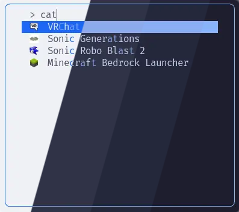
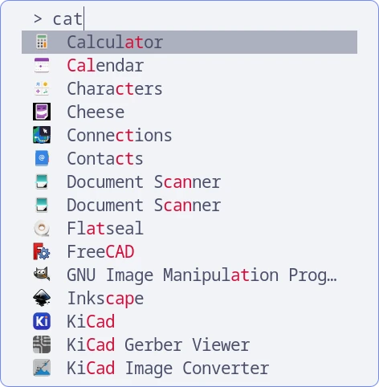
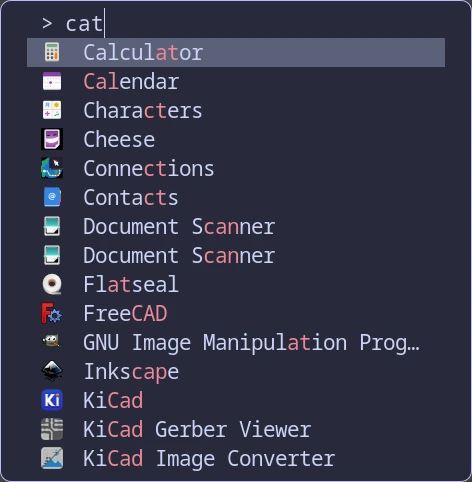
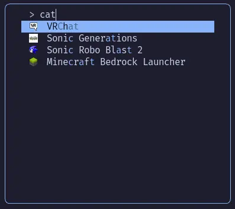

<h3 align="center">
	 
	
	Catppuccin for <a href="https://codeberg.org/dnkl/fuzzel">Fuzzel</a>
	
</h3>

	
	
	

	

## Previews

🌻 Latte

🪴 Frappé

🌺 Macchiato

🌿 Mocha

## Usage

1. Open your `fuzzel.ini` file, found in `$XDG_CONFIG_HOME/fuzzel/`
(defaulting to `$HOME/.config/fuzzel/fuzzel.ini` if `$XDG_CONFIG_HOME` is unset).

1. Remove existing `[color]` section if there is one.
1. Include the flavor and accent combination of your choice from [`themes/`](./themes/) into your 
   configuration file using `include=<path-to-your-theme-file>` in the main section scope of `fuzzel.ini`.
   (if you are using Fuzzel >= 1.10) or copy the contents of one of the files (if you are using Fuzzel < 1.10).
1. Invoke `fuzzel` using a keybinding or from the terminal.

<!-- this section is optional -->
## 🙋 FAQ

-	Q: **_"How can I get window transparency?"_**\
	A: Change the last two characters in the color value for `background`, where
	`00` is transparent and `ff` is opaque.

## 💝 Thanks to

- [tetov](https://tetov.se/)

	

	Copyright &copy; 2021-present <a href="https://github.com/catppuccin" target="_blank">Catppuccin Org</a>

	

